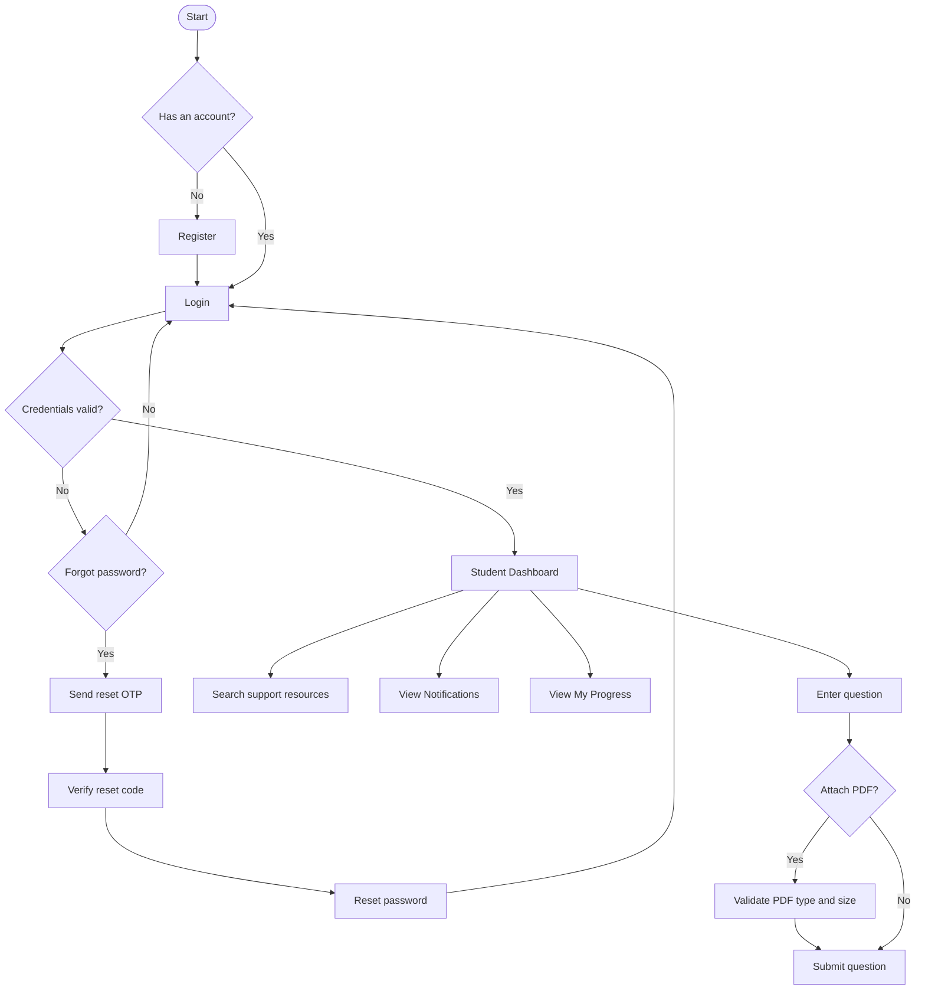

# Activity Diagram

```mermaid
flowchart TD
  Start([Start]) --> Auth{Has an account?}
  Auth -- No --> Register[Register] --> Login[Login]
  Auth -- Yes --> Login
  Login --> Valid{Credentials valid?}
  Valid -- No --> Forgot{Forgot password?}
  Forgot -- Yes --> Send[Send reset OTP] --> Verify[Verify reset code] --> Reset[Reset password] --> Login
  Forgot -- No --> Login
  Valid -- Yes --> Dashboard[Student Dashboard]
  Dashboard --> Search[Search support resources]
  Dashboard --> Notify[View Notifications]
  Dashboard --> Progress[View My Progress]
  Dashboard --> Question[Enter question]
  Question --> PDF{Attach PDF?}
  PDF -- Yes --> Validate[Validate PDF type and size] --> Submit[Submit question]
  PDF -- No --> Submit
```
