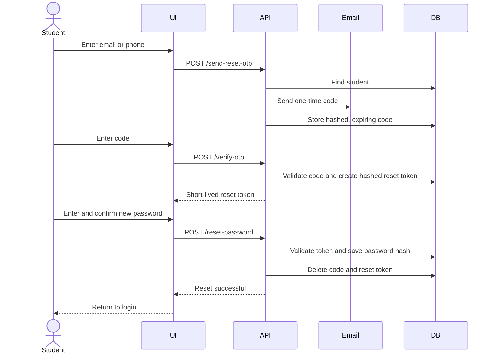
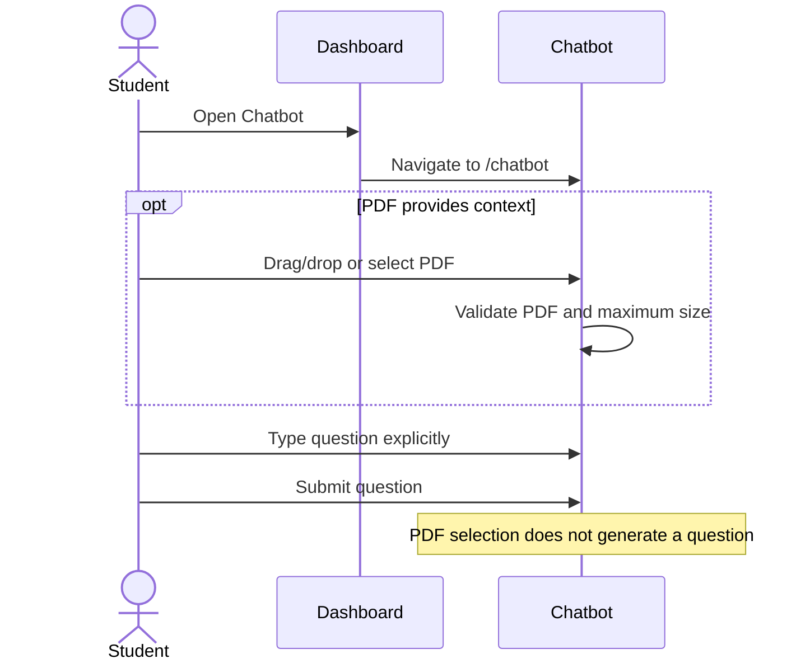

# Sequence Diagrams

## Forgot and Reset Password

```mermaid
sequenceDiagram
  actor Student
  participant UI
  participant API
  participant Email
  participant DB
  Student->>UI: Enter email or phone
  UI->>API: POST /send-reset-otp
  API->>DB: Find student
  API->>Email: Send one-time code
  API->>DB: Store hashed, expiring code
  Student->>UI: Enter code
  UI->>API: POST /verify-otp
  API->>DB: Validate code and create hashed reset token
  API-->>UI: Short-lived reset token
  Student->>UI: Enter and confirm new password
  UI->>API: POST /reset-password
  API->>DB: Validate token and save password hash
  API->>DB: Delete code and reset token
  API-->>UI: Reset successful
  UI-->>Student: Return to login
```

## Student Question with Optional PDF

```mermaid
sequenceDiagram
  actor Student
  participant Dashboard
  participant Chatbot
  Student->>Dashboard: Open Chatbot
  Dashboard->>Chatbot: Navigate to /chatbot
  opt PDF provides context
    Student->>Chatbot: Drag/drop or select PDF
    Chatbot->>Chatbot: Validate PDF and maximum size
  end
  Student->>Chatbot: Type question explicitly
  Student->>Chatbot: Submit question
  Note over Chatbot: PDF selection does not generate a question
```
