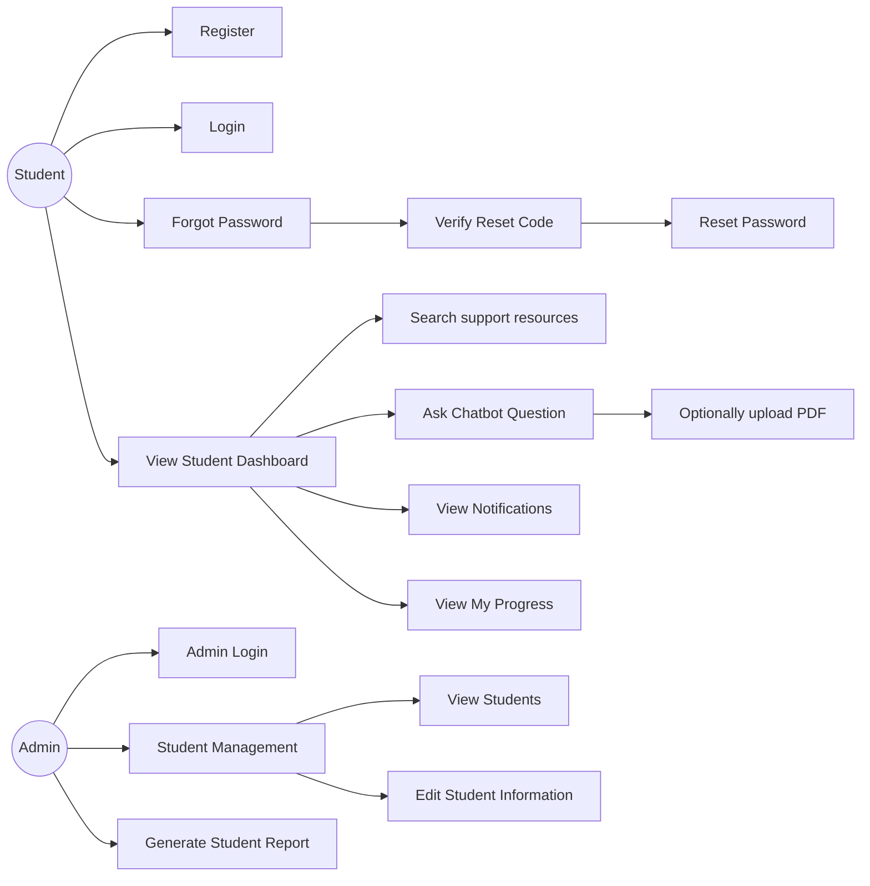

# Use Case Diagram

```mermaid
flowchart LR
  Student((Student)) --> Register[Register]
  Student --> Login[Login]
  Student --> Forgot[Forgot Password]
  Forgot --> Verify[Verify Reset Code]
  Verify --> Reset[Reset Password]
  Student --> Dashboard[View Student Dashboard]
  Dashboard --> Search[Search support resources]
  Dashboard --> Chat[Ask Chatbot Question]
  Chat --> Upload[Optionally upload PDF]
  Dashboard --> Notifications[View Notifications]
  Dashboard --> Progress[View My Progress]
  Admin((Admin)) --> AdminLogin[Admin Login]
  Admin --> Manage[Student Management]
  Manage --> ViewStudents[View Students]
  Manage --> EditStudents[Edit Student Information]
  Admin --> Report[Generate Student Report]
```
